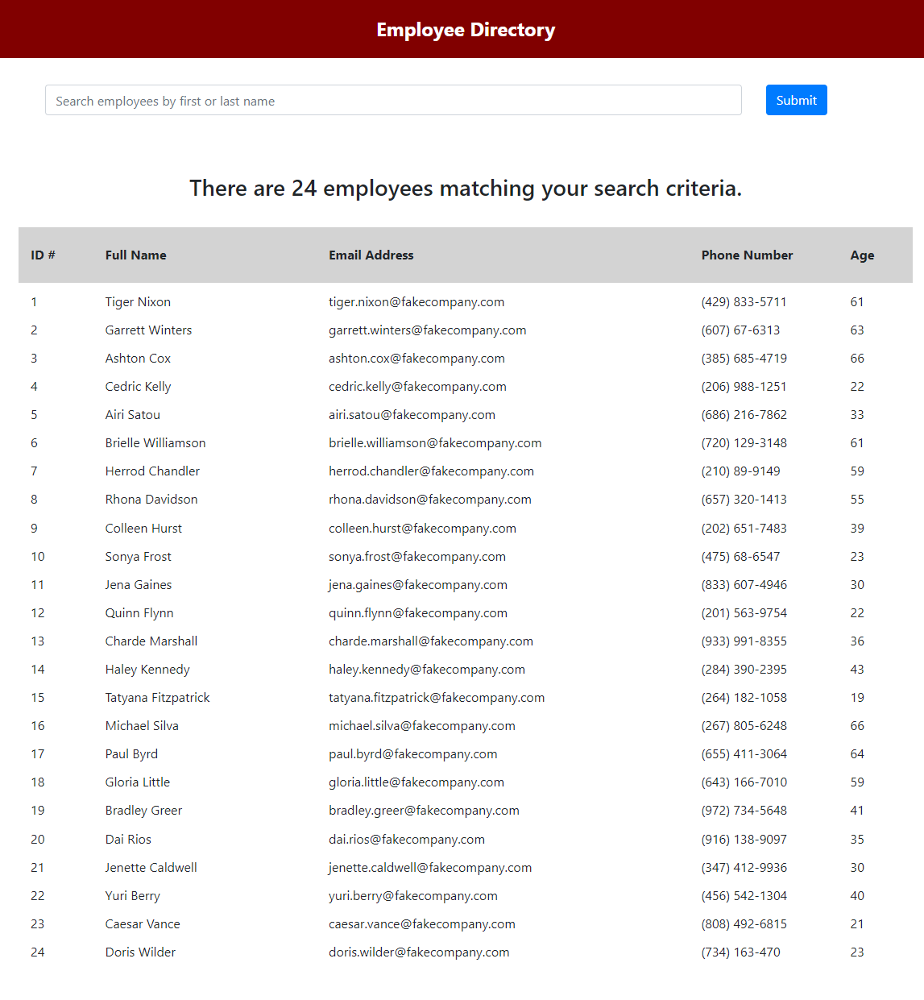

# React-Employee-Directory
Homework 19 React

## Overview

In this assignment I created an employee list using React. Dependant on the amount of data from the data source. The application displays how many lines of data "employees" are currently shown. The list is filterable using a search term on name. The counter updates to reflect how many filtered results are available.

## Github Link:

https://github.com/martinhemphill/React-Employee-Directory

## Heroku Link:

https://react-homework-19.herokuapp.com/

## Screenshots:

